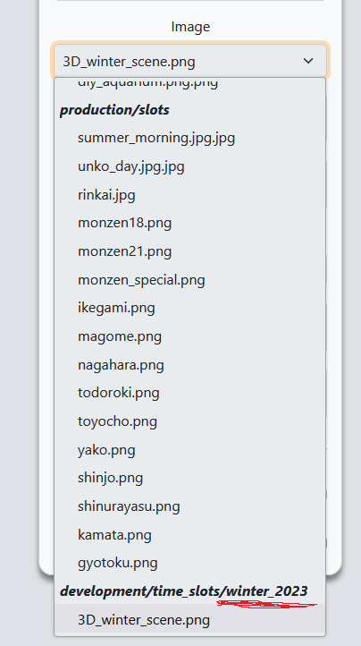

## Prep

### Uploading images

If the new event uses new images, you'll want to upload them first. Admins can do this by clicking `Import/Export Files` in the admin tasks card at the bottom of their profile page, then `Upload Assets` on the next screen.

Uploading multiple images at once works fine, but keep in mind they'll all be uploaded to the same folder. Only `.avif`, `.jpeg`, `.png`, `.svg` and `.webp` files are permitted.

:::caution
Upload the event calendar and activity images separately; they need to be in separate folders.
:::

Once you've selected your images, choose the folder you want to upload them to (activity images go in Time Slots) and enter the name of the event they're for. Whatever you enter here will be downcased and have its spaces replaced by underscores.

If you're adding images to an existing event, try to use the same name as the existing images for that event. You can check that by going to daily activities and trying to edit a random activity from that event; the current folder name is the text of the option group after the last slash, e.g. 'winter_2023' in this case

### Confirming Options

To avoid the complexity of nesting option creation two levels deep in the event creation process (especially in a way that doesn't require manually inputting identical options for every activity) options are automatically generated based on the time slot's category. Therefore it's best to check these default options still match the current choices/pricing before creating a new event.

The current automatically generated options and the conditions under which they're applied can be found in [`time_slot.rb`](https://github.com/KUJP-code/db_prototype_v2_official/blob/main/app/models/time_slot.rb).

Speaking of afternoon slots, they are also automatically generated for each morning slot (unless the morning slot's category is special or party), and have their own autogenerated options. Autogenerated afternoon slots have the same name as their morning slot, no image and their category is set to seasonal regardless of the morning slot's category.

You can add new options which should apply to ALL new time slots matching the specified conditions by adding a new element to the constant arrays at the bottom of the file. To make changes to the options for a specific time slot, see [Changes after creation](#changes-after-creation).

### Confirming Pricing

If the price lists are unchanged from the previous seasonal (or any other past seasonal event) you can skip this section and simply select those past price lists when creating the new event.

If prices have changed for internal or external kids you'll need to create a new price list for each category that changed. Do this through `Manage Price Lists` in your admin tasks card on the profile page.

You'll be taken to a page which lists all previous price lists, click the `Create Price List` button at the top.

:::caution
Don't edit past price lists to existing prices and use them for new events! Always create a new price list if prices have changed.
:::

All fields are required, and the name should be in the form "#{event} #{member/non-member} #{year}".

If creating a price list for something like a party which doesn't use all the possible courses, add prices for the courses which can actually be reached and set the price for all other courses to 9999999999 so it's nice and obvious there's a bug if someone manages to register for more stuff than should be possible.

## Creating the Event

Once you've completed the [Prep](#prep) section, go to the event index by clicking `Events` on the nav bar then click the `Create New Event` button. Alternately, use the `Create New Event` button found in the admin tasks card on your profile.

The form is fairly self-explanatory, but keep in mind that the image select box will only contain images uploaded to the `event` folder in the earlier [Uploading Images](#uploading-images) step. If you don't see your image here, take the opportunity to go back and check you successfully uploaded it the the `Event` folder, and also check your activity images were successfully uploaded to the `Time Slot` folder. Abandoning or refreshing once you've hit `Create Event` on this page will cause issues, so it's good to be sure. If you'd like to be very sure your activity images were uploaded correctly, try editing an existing activity and checking its image select box for your uploaded images.

If creating an event for all schools (which should almost always be the case) make sure `All` is selected in the School dropdown.

Be sure to add the Photo Service option and any other event options during this step, else they'll have to be added to each school's event individually later.

:::danger
Once you click `Create Event`, abandoning the process or refreshing the page will cause issues. Make sure your [Prep](#prep) is completed before doing so.
:::

## Creating the Time Slots

After clicking `Create Event` on the previous page, you'll be taken to a new page which lists the events you're adding time slots for on the left side. From here, you can simply click `Add Activity` and fill in the form that appears for each activity you need to add to this event.

:::note
For special days with both morning/afternoon activities, only add the morning activity here and ensure its category is set to special. We'll add the afternoon activity in [Special Afternoons](#special-afternoons).
:::

Once you've filled in the details for each activity and **checked them carefully**, click `Update Activities` to add those activities to all events listed in the left sidebar. This will take a little while, especially for large events like Summer.

If the activities are added successfully, you'll be redirected to the event index and see a success toast pop up, along with your newly created events. You're not done yet though, we still need to add the afternoon activities for any special days and set the goal for each school.

## Changes

### Special Afternoons

To add afternoon activities to a special day, go to `Activities` in the top navbar and find the special day (at any school is fine) then click `Edit Activity`. You'll be taken to a form for that activity, with the event it belongs to in a sidebar on the left.

Make sure to check the `Create afternoon slot for all activities with this name` box, then click `Create Afternoon Slot` to reveal a form for the afternoon slot. Fill in its details, then click `Update Time Slot` to create that afternoon slot for all activities with the same name at all other events.

### Goals

Go to the event index, and edit each event to have the correct goal for its school. If we get so many schools it becomes a real chore I'll make a faster way, but this should do for now.

### Options

If a certain activity needs special options removed/added, find that activity in the activity index for its school and manually add/remove the options through the `Customise Options` dropdown, then click `Update Time Slot`.
