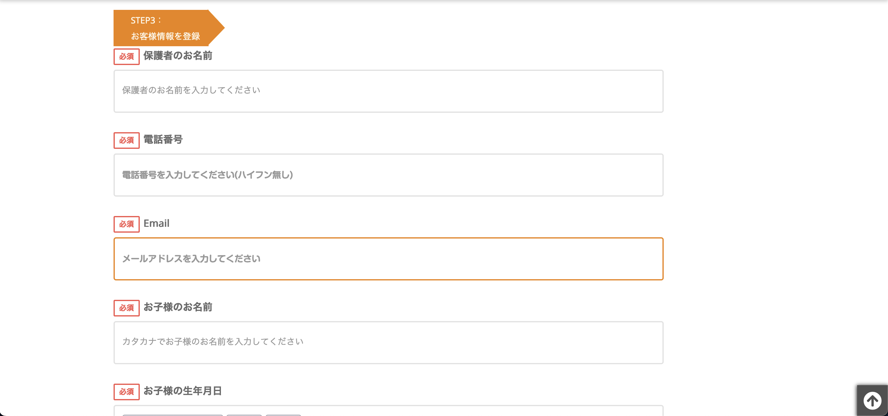

## Setsumeikai Calendar

On the new page, the school list comes before the calendar and a school must be chosen to view setsumeikais.

Only setsumeikais for the selected school are displayed.

### School List

#### Old

![Old school list mobile]

#### New

![New school list]

![New school list mobile]

### Calendar

#### Old

#### New

![New calendar]

![New calendar mobile]

### Form

#### Old

![Old form mobile]

#### New

![New form]

![New form mobile]

### Summary

#### Old

![Old summary]

![Old summary mobile]

#### New

![New summary]

![New summary mobile]

## Inquiry Sheet

#### Old

#### New

## Attendance Sheet

#### Old

![Old attendance sheet]

#### New

![New attendance sheet]
