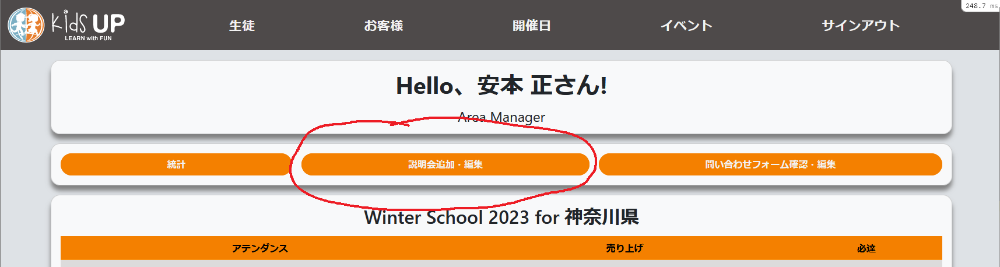
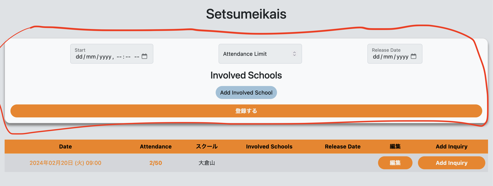
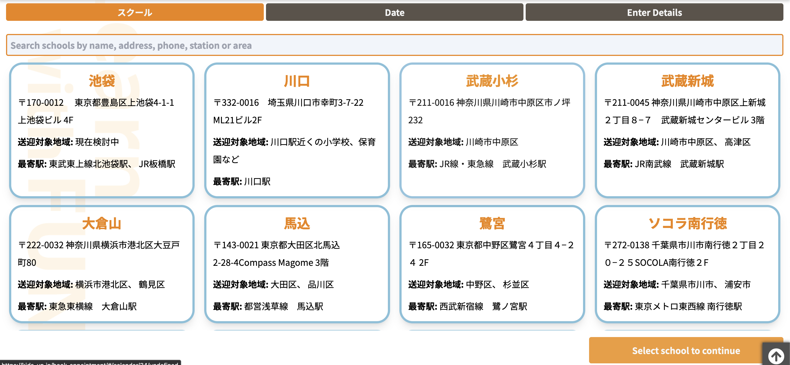
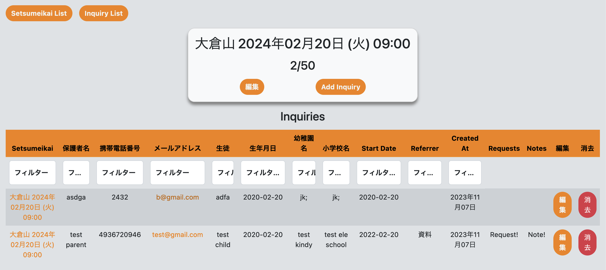
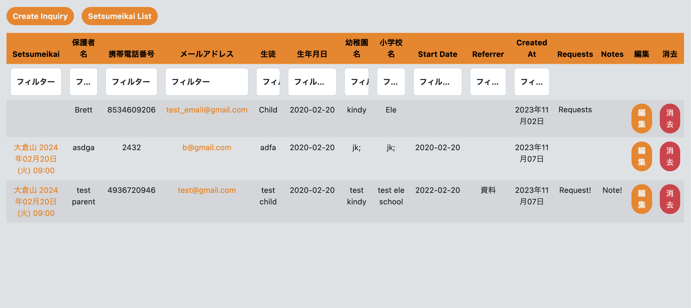

## 1. Create some setsumeikais

Log in to the <a href="https://kids-up.app/" target="_blank">seasonal registration site</a>.

Click Manage Setsumeikais.

Fill in the form 2-3 times to create some setsumeikais.

## 2. Register for a setsumeikai as a customer

In a new tab, go to the main site's <a href="https://kids-up.jp/book-appointment/#/school_list" target="_blank">new inquiry form</a>.

Search for then click on your school, then click on one of the setsumeikais you just added. Fill in the form and submit.

You should receive an email to your school email address soon after submitting, in addition to an email to the address you entered as a customer (they can be the same address).

## 3. Check your inquiries on the seasonal registration site

Go back to the seasonal registration site tab and refresh the page. You should see the inquiries you just made in the attendance column of the setsumeikai list. Click on the attendance number to go to the attendance list for that setsumeikai.

You can manually add inquiries/attendees here if you receive them in person or in other ways.

If you click Inquiry List you'll be taken to a list of all inquiries for your school, including 'R' and 'I' type inquiries. 'C' inquiries are still exclusively in the Google Sheets.

## 4. Add the inquiries to Google Sheets

Finally, to import inquiries to the Google Sheets, go to <a href="https://drive.google.com/drive/folders/1q8jnRZbL93Y9PHjRwTNZCYA9jXAnqhUe" target="_blank">this folder</a> and open the sheet corresponding to your school.

Click the green button (①HP 情報取得), and authorize it to access your data. Then click the button once again. You should see the inquiries you created appear on the sheet after some time.

Inquiries will also be automatically imported at around 4pm every day.
